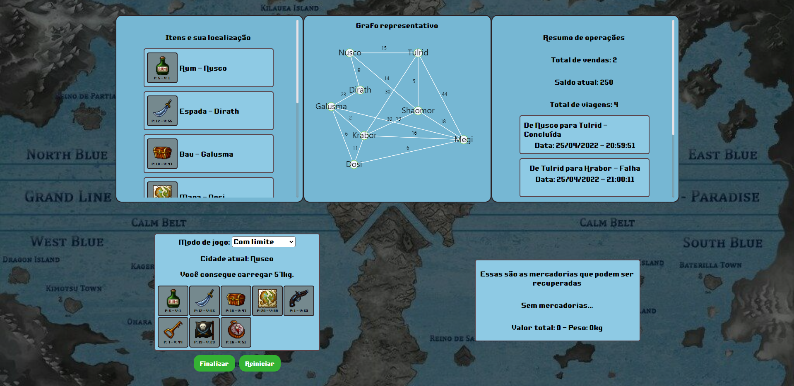
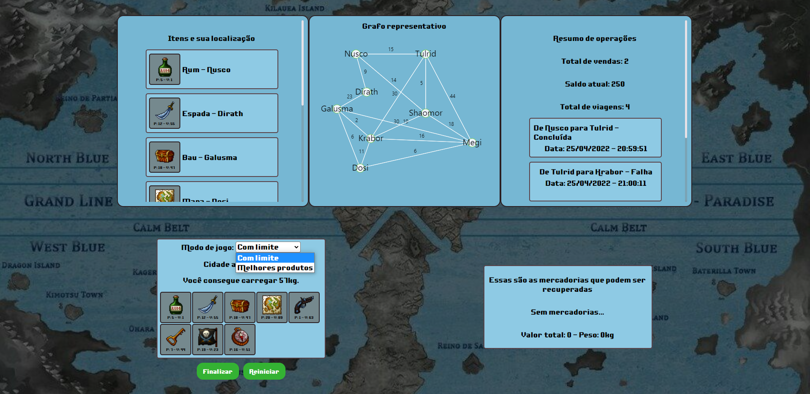
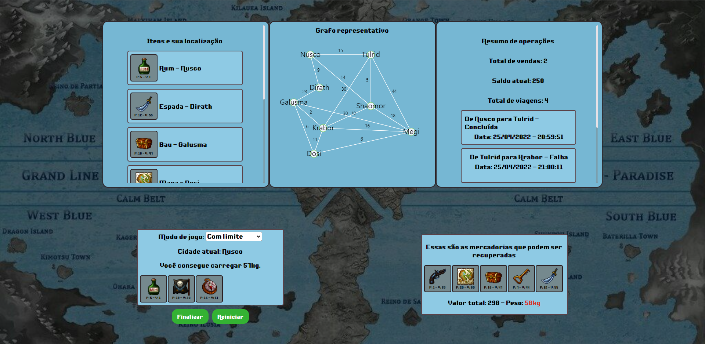
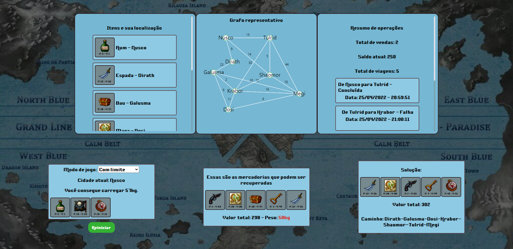
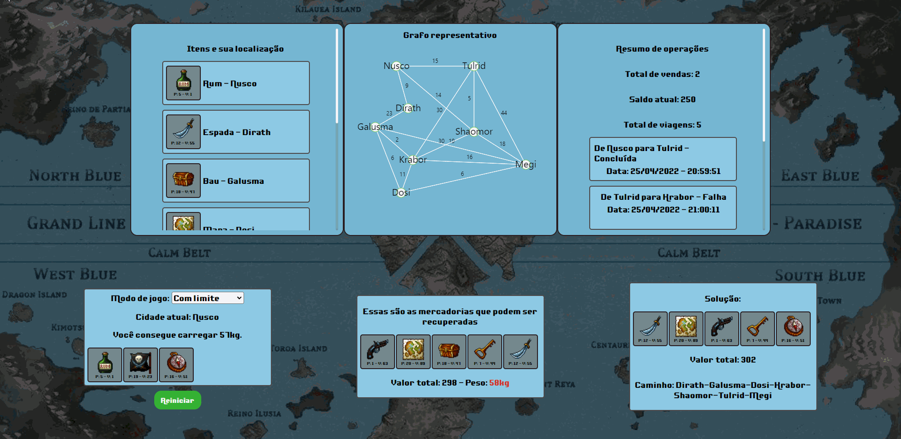
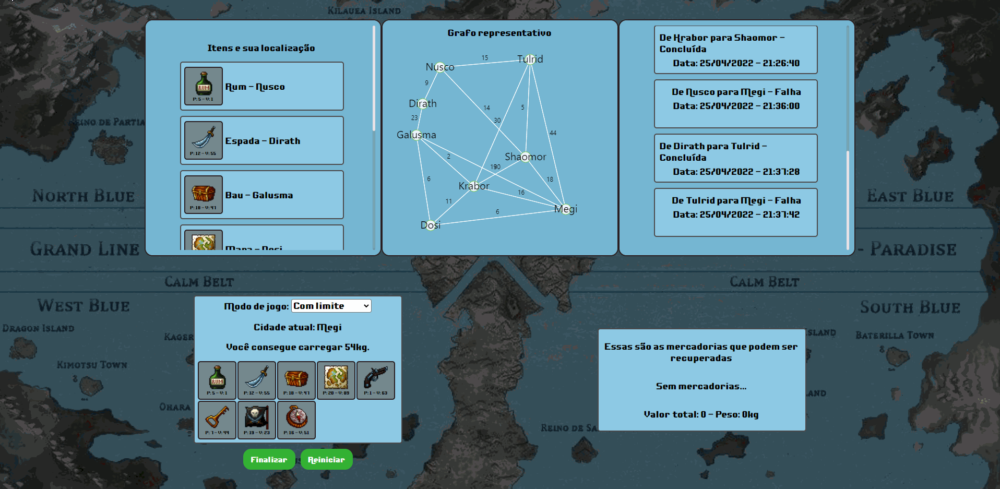

# Pirate Knapsack

**Número da Lista**: -<br>
**Conteúdo da Disciplina**: Trabalho final<br>

## Alunos
|Matrícula | Aluno |
| -- | -- |
| 16/0127891 |  João Vitor de Moura Rosa Silva |
| 16/0016169  |  Nícalo Ribeiro |

## Sobre 
O objetivo do trabalho é demonstrar uma variação do algoritmo de menor caminho entre nós de um grafo, baseado em um [estudo](https://www.mdpi.com/2073-8994/13/3/421/htm) que propõe uma solução mais otimizada que o de dijkstra para o problema de encontrar o menor caminho de uma fonte de um grafo para vários destinos. Foi feito também um outro algoritmo, que eleva a dificuldade desse problema de menor caminho com vários destinos, ao limitar o maximo que pode-se percorrer no grafo. Para ambos os casos, foi desenvolvido um programa que se comporta como um jogo, onde ao serem roubados por piratas, navegadores descobrem os paradeiros de suas mercadorias roubadas e vão atrás de recuperá-las. A cada rodada haverá um limite de peso em seu navio e os itens carregados não podem ultrapassar esse limite.  
- O objetivo é conseguir a maior pontuação possível. 
- Em cada rodada selecione os itens que achar que te darão a maior pontuação, imaginando passar pelas rotas nos grafo de maior valor e respeitando o limite de peso fornecido. Superar o limite de peso será considerado falha. 
- O jogo possui 2 modos, que podem ser trocados na opção modo de jogo, em que cada modo corresponde a um algoritmo que dará a melhor solução possível. 
- No modo "Melhores produtos", é utilizado o algoritmo baseado no estudo citado anteriormente e foca em dar a maior pontuação possível a partir de uma origem e passando pelos pontos, inclusive mais de uma vez, e respeitando os limites de peso.
- No modo de jogo "Com limite", a solução é dada pelo segundo algoritmo citado e é necessário, a partir de seu ponto de origem, percorrer uma distância menor que o valor das rotas percorridas, evitando passar em um ponto mais de uma vez.
- Ao final de cada rodada, será mostrada a melhor solução. É possível acompanhar seu histórico de rodadas, assim como quantas vendas foram feitas e o total de viagens.

## Vídeo de apresentação
[Vídeo de apresentacao](screenshots/final_dupla30_nicaloribeiro_joaovitor.mp4)  
Caso o link não funcione, o vídeo está dentro da pasta 'screenshots' e tem o nome de 'ProjetoDeAlgoritmosD-C-Dupla30'
Link do one drive: [Vídeo de apresentação](https://unbbr-my.sharepoint.com/:v:/r/personal/160127891_aluno_unb_br/Documents/Grava%C3%A7%C3%B5es/Reuni%C3%A3o%20com%20Nicalo%20Ribeiro%20Dourado%20Araujo-20220425_211631-Grava%C3%A7%C3%A3o%20de%20Reuni%C3%A3o.mp4?csf=1&web=1&e=ga3ImJ)
## Screenshots
- Tela inicial  



- Seleção do modo de jogo



- Itens selecionados 



- Itens selcionados com a solução  



- Visão geral



- Demonstração
  


- Demonstração



## Instalação 
**Linguagem**: Javascript<br>
**Framework**: React js, Node js e Mongodb<br>
Um dos pré requisitos para rodar o projeto é ter o docker e o docker-compose instalados. Caso não possua, é necessário ter algum gerenciador de pacotes node (npm ou yarn) e acesso ao mongodb, seja local ou em nuvem.
## Uso 
- Com docker  
```
docker-compose up --build
```
A aplicação estará disponível em http://localhost:3001/  

- Com npm ou yarn   
Para subir o frontend vá até a pasta my-app e execute
```
npm start OU yarn start
```  
o frontend estará disponível em http://localhost:3000/  

Para subir o backend vá até a pasta api e execute  
```  
npm run dev ou yarn dev  
```  
Para conectar no banco de dados, vá até /api/src/config/mongodb.js e coloque o link para sua instância de mongodb.    
O backend estará disponível em http://localhost:5000/  


